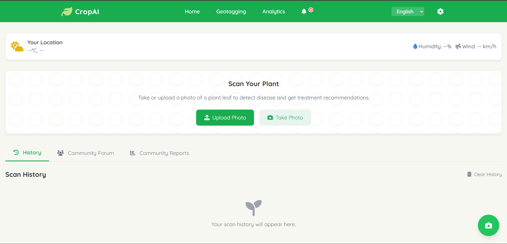
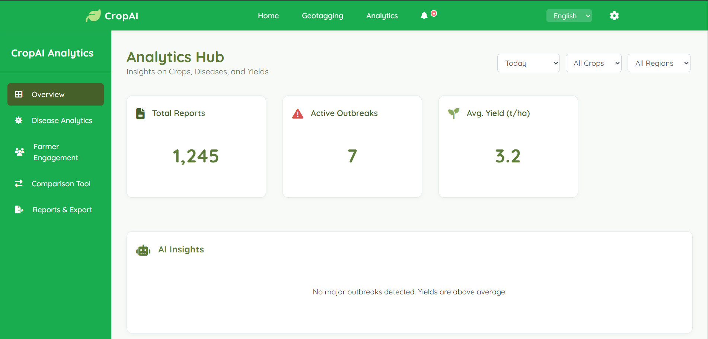
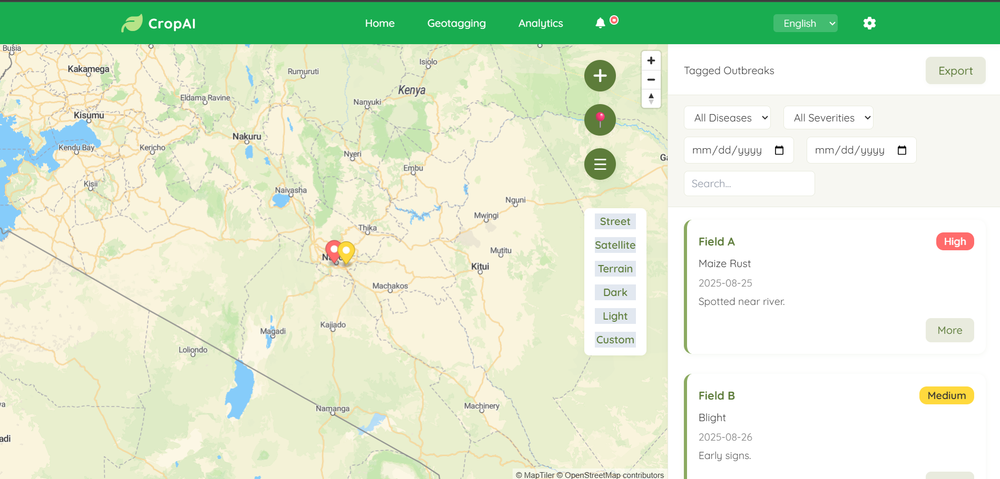
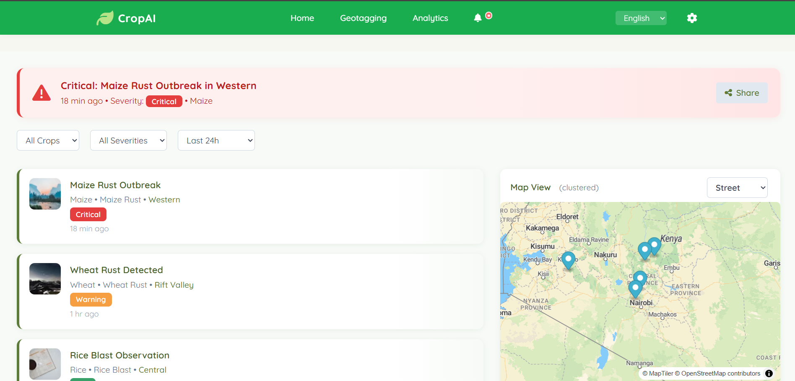

# 🌱 CropGuard AI — Smart Farming Insights Platform
AI-powered crop disease detection, geotagging, and farmer engagement tool.

<p align="center">
	
</p>

---


---

## 🚀 Project Overview

CropGuard AI helps farmers detect crop diseases early, report them with geotagged photos, and access real-time analytics and AI-driven yield predictions. Designed for accessibility, offline-first use, and community-scale insights.

---

## 📚 Table of Contents

- [Features](#-features)
- [Screenshots](#-screenshots--demo)
- [Tech Stack](#-tech-stack)
- [Setup Guide](#-setup-guide)
- [Usage](#-usage)
- [Contributing](#-contributing)
- [Roadmap](#-roadmap)
- [License](#-license)
- [Contact / Credits](#-contact--credits)

---

## ✨ Features

- 📸 **Disease Reporting** — Upload geotagged photos with offline sync
- 🌍 **Geotagging Map** — Interactive MapLibre map with farmer pins & hotspots
- 📊 **Analytics Dashboard** — Disease trends, yield predictions, engagement stats
- 🚨 **Disease Alerts** — Real-time notifications on outbreaks & recommendations
- 📑 **Reports & Export** — Generate PDF/CSV reports for sharing
- 🗣️ **Multilingual Support** — English, Swahili, French, Hindi, Spanish
- 🌗 **Dark/Light Theme** — Toggle for day/night use
- 🧑‍🌾 **Community Forum** — Farmer Q&A, experience sharing
- 🗃️ **Offline Mode** — Store scan history locally

---

## 🖼️ Screenshots / Demo

<p align="center">
	
	
	
</p>

---

## 🛠️ Tech Stack

- **Frontend:** HTML5, TailwindCSS,CSS, Vanilla JavaScript
- **Mapping:** MapLibre, MapTiler
- **Backend:** (Pluggable) —custom API
- **AI:** TensorFlow.js / OpenAI API (disease prediction)
- **Notifications:** 
- **Icons:** Font Awesome
- **Fonts:** Quicksand (Google Fonts)

---

## ⚡ Setup Guide

```bash
# Clone repo
git clone https://github.com/Vulimwa/Agrivision_Ai_project.git
cd cropAI

# Install dependencies (if using a build system)
# npm install

# Add environment variables (if needed)
# MAPTILER_API_KEY=xxxx

# Or simply open index.html in your browser for the demo
```

---

## 🧑‍💻 Usage (Walkthrough)

1. Sign up or log in as a farmer
2. Submit a disease report (upload + geotag)
3. View insights in the analytics tab
4. Receive disease alerts & recommendations

---

## 🤝 Contributing

Contributions are welcome 🎉

- Fork the repo
- Create a new branch (feature/your-feature)
- Submit a PR

---

## 🗺️ Roadmap

- [ ] AI-driven pest detection via camera
- [ ] SMS-based farmer engagement
- [ ] Multilingual voice assistant
- [ ] More advanced analytics and export options

---

## 📜 License

MIT License — see [LICENSE](LICENSE) for details.

---


## 👥 Contact / Credits

Built by Bravin Vulimwa & contributors:

- Bravin Vulimwa ([Portfolio](https://code4cities.vercel.app)
- [Murage](https://github.com/Idon-got-rabies)
- [@nyorusam](https://github.com/nyorusam) 
- [@pkonsomu2020](https://github.com/pkonsomu2020)
- [@senator423](https://github.com/senator423) (xiks)

---

## 👩‍🌾 Farmer Story

> “With CropGuard AI, I detected a disease on my maize early, got instant advice, and saved my harvest. The map showed others nearby facing the same issue — we connected and solved it together!”

---

## 📝 File Structure

```
cropAI/
├── index.html          # Main application
├── login.html          # Login page
├── signup.html         # Sign up page
├── main.html           # Main dashboard
├── analytics.html      # Analytics dashboard
├── geotagging.html     # Geotagging map
├── alerts.html         # Alerts & notifications
├── assets/             # Images, CSS, JS
└── README.md           # This file
```
